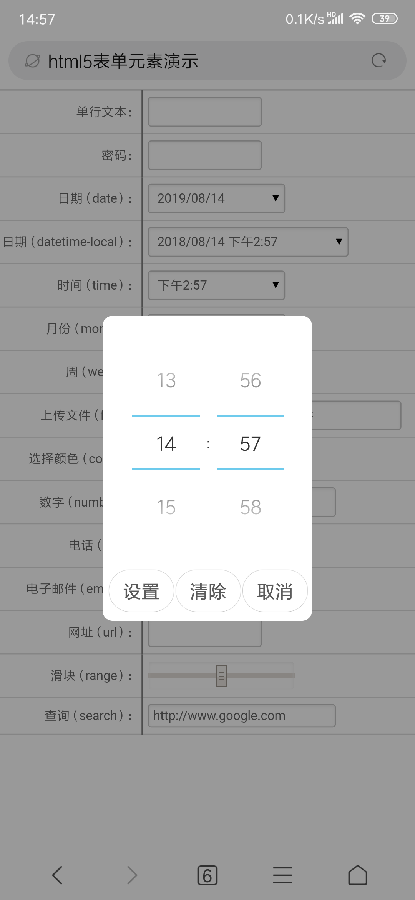

# Vue组件入门篇————表单组件

> 做项目的时候会遇到一个比较头疼的问题，一个大表单里面有好多控件，一个一个做设置太麻烦，更头疼的是，需求还总在变化，一会多选、一会单选、一会下拉的，变来变去的烦死宝宝了。  

　　那么怎么解决这个问题呢？我们可以做一个组件来搞定这些烦人的事情。我们使用Vue.js基于原生HTML来做一套表单控件！  

　　前端不管是哪种框架、类库，其基础都是HTML、CSS和JavaScript，不管用什么方式写项目，我们都有必要先了解一下基础知识。所以呢我们先来看看HTML5的表单和表单元素都有哪些属性以及功能。  

## HTML5原生的表单和表单元素

　　要想做好表单组件，必须先知道HTML5里面的表单和表单元素都有哪些属性，以及属性的效果和作用，否则的话可能折腾半天才发现，原来HTML5已经自带了这个功能！  
　　比如要实现这样一个功能：文本框只能输入数字，然后要加上两个按钮，按一个数值+1，按另一个数值-1。以前要写js代码实现，现在只需要把type改成number就可以了。而且可以对输入的文字做拦截，非数字根本输入不进去，这样就不用我们自己再去写代码实现了。所以磨刀不误砍柴工，我们先来整理一下，表单和表单属性都有哪些属性。  

### 表单属性
  

　　首先是表单（&lt;form&gt;）的属性，&lt;form&gt;的属性主要是对表单元素做一个统一设定，比如表单里的元素是否需要自动完成的功能，以及提交的时候是否需要做验证等。如果某个表单元素不符合这个统一设定的话，可以给表单元素单独设置属性进行说明。这样就更灵活和方便了。  
　　其他的就是通过submit按钮对表单进行一些控制的属性了。不过这些都是针对表单提交的，我们现在基本都是ajax，所以这些属性基本都用不上了。  

### 表单元素的分类
　　表单元素都有哪些？说到分类就有点头疼，&lt;intut&gt;一开始理解是文本类的，输入嘛，结果现实却很丰满，提交按钮也用这个，还有单选和多选也是这个input。多行文本反倒不是这个了，而是单独的一个。不过不管那么多了，还是从使用的角度来分类：文本框类和选择类。  
　　&lt;intut&gt;的type增加了一些新的类型，在PC机的浏览器里面看，区分不是很大，但是到了手机浏览器里面，区分就比较大了，主要是可以控制打开的输入法的默认模式。比如number，打开输入法之后，直接就是数字方式，这个就很人性化，方便用户操作。  
　　我们先看一下分类：  
  

#### HTML5新增特性  

　　新增的特性（好吧也不算新了，都好多年了），主要是对文本框的增强，增加了一些类型以及辅助功能，比如增加了一个备选框（&lt;datalist&gt;）的功能，这个还是比较实用的吧。  
  

### 在手机网页里的展现效果

　　表单元素在PC浏览器里是什么样子的，大家很容易看到，那么在手机浏览器里是什么样子的呢？先看一下表单整体效果：  
  

　　注意看那几个带下三角的，那个不是下拉列表框，而是日期相关的，可以选择日期时间等。具体效果我们一个一个看。  

1. 单行文本type="text" 
　　还是老样子的文本框，也是使用最多的表单元素。还是原来的样子，不贴图了。  

2. 多行文本&lt;textarea &gt; &lt;/textarea&gt;
　　一般会被富文本编辑器代替。还是不贴图了。  

3. 密码 type="password"
　　这个就不一样了，系统不同表现也不同，比如某系统会变成系统特定的输入法，而不是用户设定的输入法，并且不让截屏，所以我只好拍照片了。  
  

4. 日期 type="date"
　　手机浏览器里面，如何方便的输入日期？很简单，只需要设置type=”date”就可以了，至于效果如何吗，就要看手机系统、版本、浏览器、输入法的了。我手头测试设备很少，不能全面测试，举一个作为例子，大家看一下效果图：  
  
 
5. 日期时间 type="datetime-local"
　　这个不仅可以选择日期，还可以选择时间。不过要注意type="datetime"是不行的（各大浏览器都不支持），要用type="datetime-local"才行。不多说了，看图。  
  
 
6. 时间 type="time"
　　单独选择时间的。  
  
 
7. 月份 type="month"
　　选择年和月的，不是只有月份。  
  
 
8. 周 type="week"
　　同理，也是选择年和周，一年内第多少周。  
  
 
9. 上传文件和图片 type="file"
　　上传功能，有一个特性，可以调用手机摄像头（后摄）拍照，然后还可以访问拍下来的照片，于是就产生了一种功能，扫码二维码。在网上找了半天，已经有测试成功的了。以前以为手机浏览器无法扫二维码呢，现在看来也是可以的。悄悄的透露一下地址：https://blog.csdn.net/yisuowushinian/article/details/50548742   
  
 

10. 选择颜色 type="color"
　　可以调用系统的调色板，选择颜色，不过对于我这样没有艺术细胞的人，只能是瞎点。  
  
  
    
11. 数字 type="number"
　　这个首先可以设定输入法为数字状态，不用再从中文改成数字了，省去用户的一个步骤，有些版本还可以限制用户更换状态。想输入英文、汉字是没戏了，不过还是有点小问题，因为小数点、正负号、e都属于合法字符，所以可以输入，但是却没有判断数量和位置。  
　　比如小数点可以输入n个，+-号可以任意位置输入。这就有点郁闷了。还有科学计数法的e，这个我都忽略了，看到能输入e想了半天才想起来想的很周到，但是我输入eeee，也是可以的。既然都做了限制，为啥不顺便限制一下数量呢？  
  
 
12. 电话号码 type="tel"
　　这个嘛，有些版本会设定输入法为数字状态，有些版本就没啥效果了，如果电话号里面只有数字的话，建议用number的方式。  
  

13. 电子邮件 type="email"
　　这个也基本没啥效果。输入法应该出现@、 .com、 163.com 这类的快捷输入的，可是没有发现。不知道其他系统或者输入法有没有。  
  
 
14. 网址 type="url"
　　可以设定输入法为英文状态，但是没有出现http:// 、.com、.cn、www 这类的快捷输入。  
  
 
15. 滑块 type="range"
　　这个好像以前就有，只是不常用。不贴图了，也没啥弹出效果，直接拽就好。  

16. 查询 type="search"
　　这个唯一特点就是输入信息后，右侧可以出现一个“X”，按一下就会清空文本框。  
  
 
17. datalist
　　这个是给文本框提供一个像下拉列表框那样的备选项，还是比较实用的，只是有一个小问题，他自带过滤功能，比如输入 a 那么只会保留a开头的备选项，其他的 就都消失了。如果输入了信息只会，想换成其他备选项的话，就需要先清空才行，否则其他选项是不会出现了。不过好在我们有search，还记得他有什么功能吗？那个x。好了这两个似乎是绝配了。  
  
 

## Vue组件的基础知识
　　表单这一块为啥要做成组件呢？因为要复用呀。一个表单里面有很多很多文本框、下拉列表框，一个项目又有很多很多的表单？如果一个一个的设置属性，是不是太麻烦。如果需求变化了，要先找到这个*.vue，然后再去修改对应的属性。好麻烦的说。如果做成组件，不仅仅可以达到复用的效果，还可以做到业务需求和代码的分离！  

### 组件之hello word
　　先做一个简单的组件看看组件到底是啥样子的。下面是官网的例子（加了一个props），我们来分析一下。  
```javascript
Vue.component('button-counter', {
        props:["value"],
        data: function() {
            return {
                count: 0
            }
        },
        template: `<button v-on:click="count++">
You clicked me {{ count }} times.{{value}}</button>`
    });

    new Vue({ el: '#components-demo' });
```

```html
<div id="components-demo">
    <button-counter value="3"></button-counter>
    <button-counter></button-counter>
    <button-counter></button-counter>
    <button-counter></button-counter>
</div>

```

　　首先使用Vue.component('button-counter', {}) 注册一个组件。第一个参数就是组件的名称，后面的参数是组件的实现代码，其中包括属性（props）、内部变量（data）、模板（template）、方法（methods）等。其实组件和vue的实例还是很像的，最明显的就是多了个属性（props）和模板。  
　　属性（props）是把组件外部的数据传递到组件内部，是一个很基础的数据传递方式。可以传递的数据类型也没有限制。数字、文本、对象都可以。   
　　模板呢，就是组件内部的结构，编写方式和vue的实例是很像的。这里有个主意的地方，一开始我没注意看，“template:”后面跟的是啥？不是单引号哦，而是键盘左上角esc键下面的那个。这个符号终于派上用场了。是不是一直没按过？  
　　用这个符号框起来的可以直接换行，这样就不用一行一行的“+’”了。  
　　页面里使用<button-counter></button-counter>的方式来引用，相当于我们自己定义了一个dom。当然这个dom是需要vue来解析的，没有vue解析的话浏览器是不会识别。运行的时候也是没有<button-counter>的，直接就是我们写的模板（绑定数据后）的内容。  
　　data使用了function的形式，这个是在组件复用的时候区分多个组件的内部数据的。如果不用function的形式，复用的多个组件，将会共用同一个data值。  
　　然后就是做一个vue的实例，对div进行托管。  

　　表单是使用率最高的一个地方了，项目再小也要有个表单，那么如何更好的做好表单呢？我们思路就是————依赖注入。这个可不是sql注入攻击，大家不要弄混淆了。那么如何实现呢？让我们一一分析。  

### 组件的特点和优势

　　我们为啥要做表单组件呢？首先要看看组件的优势了，优势都有哪些呢？封装和复用、切换表单元素的形式、适配各种UI。  

1. 复用和封装  
　　等等，原生的表单元素不是也可以复用吗？为啥还要弄个组件？这个就要做一个对比了。用原生的方式做一个下拉列表框是啥样的呢？
```html
<select>
  <option value ="1">男</option>
  <option value ="0">女</option>
</select>

```
　　要写好几行太麻烦了，如果封装一下，各种设置由组件内部解决，外部传参数就可以了，那么是不是可以很方便呢？   
　　不管多复杂的表单元素，一行搞定，其他的交给组件内部处理。  

2. 可以随意切换“形态”  
> 经理说，这个下拉列表框改成单选的形式吧，这样用户选着方便。

　　于是我们只好改成这样：  

```html
<input type="radio" checked="checked" name="Sex" value="1" />男性
<input type="radio" name="Sex" value="0" />女性
```

> 过两天经理又说了：哎呀，还是下拉列表框好看，你再改回去吧。

　　。。。。。。  
　　真的吗？算了，经理说啥就是啥。看在工资的份上我忍！  
　　经理的要求必须做到，没有讨论的余地。那么怎么办呢？只能改自己了。当然不是翻来覆去的手敲，而是做成组件！  
　　比如：复选改单选，单选改下拉列表框。通过表单元素组件，改一下就可搞定。  
 
3. 适配器

　　现在vue有好多好多UI组件，用哪个好呢？现在我们可以基于原生html封装一个表单控件，那么以后呢？是不是可以针对其他UI组件封装一个表单元素控件呢？然后只要能够保证接口不变，那么我们依赖这个组件写的代码就不需要改变。  
　　最终要实现——换UI就换UI，不影响业务逻辑的代码。  

　　现在看看写表单组件是不是很有必要了呢？  

### 组件的双向绑定
　　对于表单元素，还有一个需要注意的地方，那就是数据的双向绑定！我们先来个简单的练练手，对 input 封装一下。  
```javascript
Vue.component('my-input', {
        props:["value"],
        template: `<input type="text" 
        :value="value" 
        @input="$emit('input',$event.target.value)"  
        :key="1">`
    });
var form = new Vue({ 
        el: '#components-demo',
        data:{
            formValue:{
                v1:'22'
            }
        }
    });

```


```html
<div id="components-demo">
    <my-input v-model="formValue.v1"></my-input>
     {{formValue.v1}}
</div>

```

　　先看一下页面里的使用方法，是不是很熟悉的味道，熟悉的v-model，熟悉的大括号。  
　　然后再看组件内部实现。  
　　首先定义一个属性（props）value，用于接收组件外面传递的数据，然后模板里面要做两件事情：接收参数、返回用户输入的数据。  
　　v-model是一个语法糖，外面可以直接用，但是组件内部就不能直接用了，必须拆成两块才行：一个是 :value给文本框赋值；另一个是监听input事件（代码第五行），然后使用$emit向组件外部传递值。$emit有两个参数，第一个参数是外部监听的事件，第二个参数（含后面的参数）是要传递出去的数值。  
　　可能大家看着有点晕，两个input是咋回事，我们来改变一下，就都明白了。  
`@change="$emit('event1',Date.now())" `
　　模板里加入这样一行。change是文本框的原生change事件，这里必须用原生的，不能用自定义的。  
`@change是让vue监听这个事件。`
　　$emit 是向组件外面传递消息，第一个参数event1，是外部vue监听的事件，这个可以自定义，写啥都行。  
　　第二个参数是要传递的值，这里Date.now()是当前时间，写$event.target.value 的话，就是文本框的值。也就是说，写啥都行，都可以传递出去。  
`<my-input v-model="formValue.v1" @event1="fun"></my-input>`
```javascript
methods:{
            fun:function(data) {
                alert(data);
            }
        }

```
　　外部监听自定义event1事件，然后调用methods里的方法fun。  
　　如果理解了，那么组件的消息传递算是基本掌握了。  

## 表单元素组件

1. 需要哪些属性
　　表单元素组件需要设置多少属性呢？这就是苦力活了，既然把input封装进来了，那么他的原生属性都应该能够支持，就是说要在外部可以设置。那么怎么办呢，如果一个个传递那还不如用原生的呢，所以我们设置一个对象属性，直接传递一个对象过来，这样就简单了。  
　　熟悉了表单元素的属性之后，我们可以定义一个json来保存这些属性：  
```javascript
c1:{
    //辅助
    controlId: '150', // 编号，区别同一个表单里的其他控件
    controlType: 101, // 用类型编号表示type
    colName: '姓名', //中文名称 
    isClear: false, //isClear  连续添加时是否恢复默认值
    
    //通用
    disabled: false,  // 是否禁用
    required: true, //必填 
    pattern: '', //用正则做验证。 
    tabIndex:0, // tab 键顺序
    class:'cssTxt input_t1',
    title: '',  //提示信息

    //多行文本
    rows:5,  //行数
    cols:100, //列数

    //文本框类
    name:'',  
    value: '',  
    placeholder: '请输入姓名',  
    readonly: false, //只读  
    size: 10, // 字符宽度
    maxlength: 20, //最大字符数
    autocomplete: 'on', //off
    min: 1, // 最小值
    max: 100, // 最大值
    step: 1, // 步长
    multiple: false, //是否可以有多个值，用于上传文件
    
    listKey:'browsers', //备选文字标识
     
    //选择类和备选文字的选项
    list: [{
            "id": "1",
            "name": "北京",
            "check": false
        }
        , {
            id: '2',
            name: '上海',
            check: false
        }, {
            id: '3',
            name: '广州',
            check: false
        }
    ]
}

```

　　因为json的结构可以非常灵活的组合，所以这里设计一个大而全的结构，把所有需要的属性都放在一起，使用的时候，可以根据元素类型灵活取舍。  
　　看到这里大家可能想，这样太复杂了，还不如直接使用原生的呢。大家先别急，看完下面这三点然后在下结论。    
- 不是所有类型都需要这些属性，每一个类型用到的并不多。  
- 可以写一个辅助工具来生成这个json，并不需要我们手撸代码。  
- 可以根据文档自动生成这个json。  

　　比如纯文本框（type=”text”）可以简化为：  

```javascript
colName:{
        controlId: 'colName', //ColumnID
        controlType: 116,  
        class:'cssTxt input_t1',
        placeholder: '请填写标题',  
        size: 30,  
        maxlength: 50
}

```
　　这样是不是简单多了呢？其实最简单的设置只需要 controlType 即可，其他的都可以不设置，但是也就意味着只能用默认的文本框，没有办法进行其他的设置。总之还是要看你要对表单进行多少设置。  

### 文本框类的表单元素组件

　　说了这么多，还没看到代码，是不是等不急了呢？其实代码也没啥好说的，就是用了最笨的方法，一点一点设置属性。
```javascript
 Vue.component('my-input', {
    props:["value","meta"],
    data:function(){
        return {
            type:{  //把编号变成文本的形式
            100:'textarea',         //多行文本框
            101:'text',             //单行文本框
            102:'password',         //密码
            103:'date',             //日期
            //其他略。。。。。。
            }
        }
     },
    methods:{
        //text
        textInput:function(event, meta){
            var returnValue = event.target.value;
            //添加自己的监听事件。本来想写在一起的，但是不好用，只好分开了。
            //vue的回调
            this.$emit('input',returnValue);
            
        },
        textChange:function(event, meta){
            var returnValue = event.target.value;
            //添加自己的监听事件
            this.$emit('change', returnValue,event.target, meta);  
        } 
    },
    template: `<span>
        <span v-if="meta.controlType===100">
            <!--多行文本框-->
            <textarea :id="'c'+meta.controlId" 
            :name="'c'+meta.controlId"  
            :class="meta.class" 
            :readonly="meta.readonly"
            :rows="meta.rows" 
            :cols="meta.cols" 
            @input="$emit('input',$event.target.value)"  
            @onkeyup="textChange($event,meta)"
            :placeholder="meta.placeholder"
            >
            </textarea>
        </span>
        <span v-else-if="meta.controlType>100 && meta.controlType<130 ">
            <!--文本框类-->
            <input  :id="'c'+meta.controlId" 
            :name="'c'+meta.controlId"  
            :disabled="meta.disabled"
            :class="meta.class" 
            :type="type[meta.controlType]" 
            :value="value" 
            :placeholder="meta.placeholder"
            :readonly="meta.readonly"
            :size="meta.size"
            :maxlength="meta.maxlength"
            :autocomplete="meta.autocomplete"
            :min="meta.min"
            :max="meta.max"
            :step="meta.step"
            :multiple="meta.multiple"
            :list="meta.listKey"
            :title="meta.title"
            
            @input="textInput($event,meta)"
            @change="textChange($event,meta)"
             
            :key="'ckey_'+meta.controlId">

            <!--文本框的备选项-->
            <datalist v-if="typeof(meta.listKey)!=='undefined'" :id="meta.listKey">
                <option v-for="item in meta.list" :label="item.id" :value="item.name" />
            </datalist>
        </span>
});

```

1. 属性  
　　value用于双向绑定，这个要单独设置，其他的属性统统放在meta里面。这样接口就固定了，以后需要新的属性也不用修改接口。  

2. 内部变量  
　　这个是为了做个替换，因为外部设置的是类型编号，而不是类型名称，所以内部需要做一个替换，这样浏览器才能识别。  
　　那么为啥用编号，而不直接用浏览器支持的类型呢？因为有些类型要做两种用途，比如file上传文件和上传图片。两种方式要做个区分的，比如上传图片，可以做个图片预览，图片处理等功能，上传文件的话，就没有这些了。所以要做个编号加以区分。另外像多行文本框和下拉列表框用的不是input，没有type。  

3. 模板  
　　这里就很笨了，用v-if根据controlType做判断，是哪种控件就渲染对应的模板。然后把属性一一绑定上就可以了。  
　　然后就是事件的绑定。因为用户输入内容后，要通知上层调用者，所以需要加个事件返回用户输入值。第一个input是给Vue准备的，加上这个才能实现Vue的双向绑定。  
　　那么第二个事件是干啥的？有的时候我们自己需要知道用户的输入操作，依据输入做些操作，比如联动下拉列表框。我们要知道第一个下拉列表框的change，然后设置第二个下拉列表框。这个时候就需要我们自己的事件通知。一开始想在一个函数里通知两个上层事件的，但是没有成功。所以只好分开了。Emmm，也许可以改成数据驱动的方式，这个还没太想好。  
4. 方法  
　　写了两个方法，一个是返回给Vue的，实现数据双向绑定。另一个是给我们自己用的。  

### 选择类的表单元素组件
　　选择类指的是多选组（checkbox）、单选组（radio）、复选框（checkbox）以及下拉列表框。  
```javascript
Vue.component('my-input', {
    props:["value","meta"],
    methods:{
        //select
        selectChange:function(event, meta){
            var returnValue = '';

            var items = event.target.selectedOptions; //选中项的集合
            var arr = [];
            for (var i=0;i<items.length;i++) {
                var item = items[i];
                arr.push(item.value);
            }
            returnValue = arr.join(',');

            //添加联动事件
            this.$emit('select', returnValue, meta.nextSelect);  
            //vue的回调
            this.$emit('input',returnValue);

            return returnValue;
        },

        //CheckBox
        checkChange: function (event) {
            var returnValue = event.target.value;

            if (this.meta.controlType === 155) {
                //复选框
                returnValue = event.target.checked;
            }
            else{
                //修改绑定情况
                var selectValue = returnValue;
                var arr = [];
                for (var key in this.meta.list) {
                    var item = this.meta.list[key];
                    if (item.id === selectValue) {
                        this.meta.list[key].check = event.target.checked;
                    }
                    if (item.check) {
                        arr.push(item.id);
                    }
                }
                returnValue = arr.join(',');
            }
            
            //调用上级的input事件
            this.$emit('input',returnValue);

            return  returnValue;
        },

        //radio
        radioChange: function (event, meta) {
            //单选
            var returnValue = '';

            var items = event.target.selectedOptions; //选中项的集合
            var arr = [];
            for (var i=0;i<items.length;i++) {
                var item = items[i];
                arr.push(item.id);
            }
            returnValue = arr.join(',');
            this.$emit('select', returnValue, meta.nextSelect);  //添加联动事件
            return returnValue;
        }
    },
    template: `<span>
        <span v-else-if="meta.controlType >= 150 && meta.controlType <= 152  ">
        <!--下拉列表框-->
            <select  :id="'c'+meta.controlId" 
            :name="'c'+meta.controlId"  
            :class="meta.class" 
            :multiple="meta.controlType === 151"
            @change="selectChange($event,meta)" 
            >
                <option :key="-2" value="-2" >请选择</option>
                <option  
                 v-for="(item,index) in meta.list" 
                 :key="index"  
                 :value="item.id" 
                 :selected="item.check">
                    {{item.name}}
                </option> 
            </select>
        </span> 

        <span v-else-if="meta.controlType === 153 ">
            <!--单选组 -->
            <label role="radio" v-for="item in meta.list" >
                <input 
                    type="radio" 
                    :class="meta.class"  
                    :checked="item.check" 
                    :name="'c'+meta.controlId" 
                    :value="item.id"
                    @input="$emit('input',$event.target.value)"  
                >
                <span>{{item.name}}</span>
            </label> 

        </span>

        <span v-else-if="meta.controlType === 154 ">
            <!--多选组-->
            <label role="checkbox" 
            v-for="item in meta.list" 
            class="checkbox_g_t" 
            :key="'lblchks'+item.id"  > 
                <input  :id="'c'+meta.controlId" 
                type="checkbox"
                :name="'c'+meta.controlId"  
                :class="meta.class" 
                :value="item.id"
                :readonly="meta.readonly"
                :key="'chks'+item.id"
                @input="checkChange($event)"
                >
                <span>{{item.name}}</span>
            </label> 

        </span> 

        <span v-else-if="meta.controlType === 155 ">
            <!--复选框-->
            <label role="checkbox" 
            v-for="item in meta.list" 
            class="checkbox_g_t" 
            :key="'lblchk'+item.id"  > 
                <input  :id="'c'+meta.controlId" 
                type="checkbox"
                :name="'c'+meta.controlId"  
                :class="meta.class" 
                :value="item.id"
                :readonly="meta.readonly"
                :key="'chk'+item.id"
                @input="checkChange($event)"
                >
                <span>{{item.name}}</span>
            </label> 
        </span>
    </span>`
});

```

1. 模板
　　还是老办法，用v-if判断渲染哪个模板，然后还是一个一个赋值，然后选项有一个循环，v-for一下就可以了。这里的选项格式和文本框的备选项格式采用了相同的设置。这样统一一下比较方便。  
2. 方法
　　每类控件都做一个方法，对应不同的取值方式。不知道有没有更好的方式，现在用的比较麻烦，期待更好的方法。如果发现了肯定会更新的。  
　　还有个返回值类型的问题，我是习惯返回字符串的形式，比如1,2,3 。而不是数组。因为数据库里保存的是字符串而不是数组。当然这块应该能够灵活一些，打算加一个返回值类型的设置。  

## 辅助工具
　　这么复杂的json要怎么弄？不会告诉我要手撸吧！当然不是，我这么懒怎么能手写呢，当然是弄个工具来辅助了。  
　　辅助工具的思路，首先确定要哪种类型的表单元素，然后根据类型显示需要设置的属性，然后就可以点点点了（当然有些属性需要打几个字），就可以生成json文件，同时还可以预览效果。  
　　这个只是第一步哦，后面的还会有根据文档生成的辅助工具。  
　　文档在哪里？做项目总会有个数据库文档吧，文档会描述都有啥表，啥字段。会介绍一下字段名称、字段类型、字段大小吧。这样我们就可以根据这些信息设置默认的json了。然后不能默认的再点点点一下就可以了。  
　　这个辅助工具就是用的这个表单元素组件写的，也算是一个实际应用，代码比较多，就不贴了。感兴趣的话，看下面开源介绍。  

 

## 开源

　　源码下载：[Vue表单组件](https://github.com/naturefwvue)   

　　在线演示：[Vue表单组件在线演示](https://naturefwvue.github.io/form/formHelp.html)   

　　这里是表单元素组件源码和demo，还有那个辅助工具。
　　另外会保持持续更新的，毕竟现在还只是初步学习vue实现的也只是简单的功能。
　　下图是辅助工具的页面，首先选择类型，然后预留会有变化，然后按照下面的属性选择即可，同时预览也会有对应的变化。
 
最后感谢大家的支持！  
